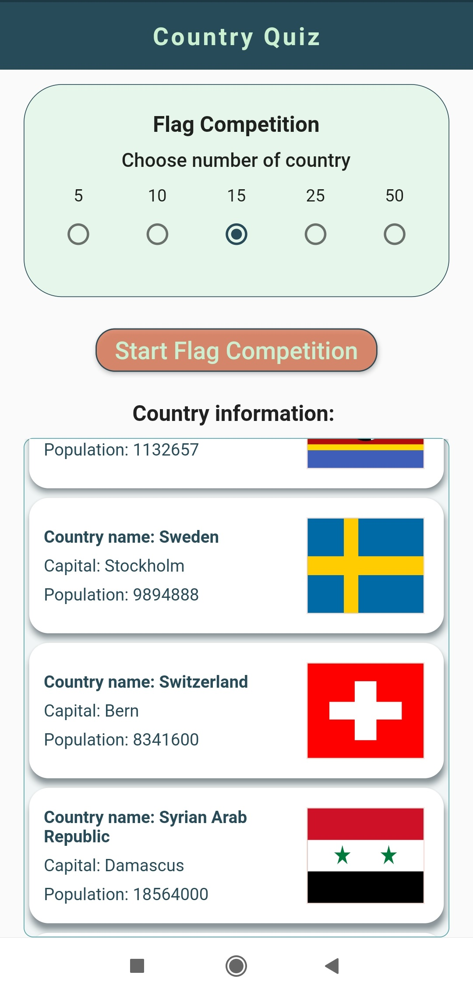
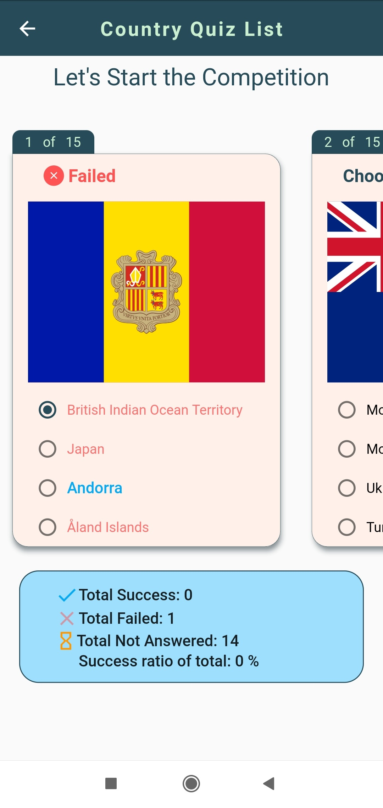
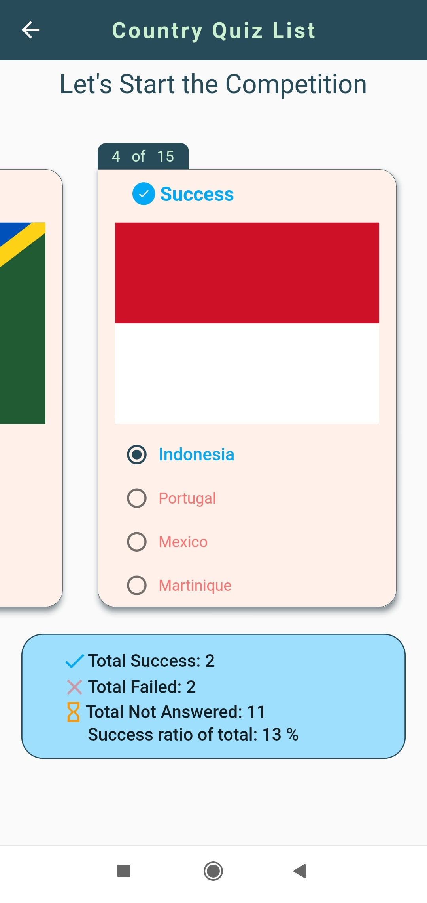
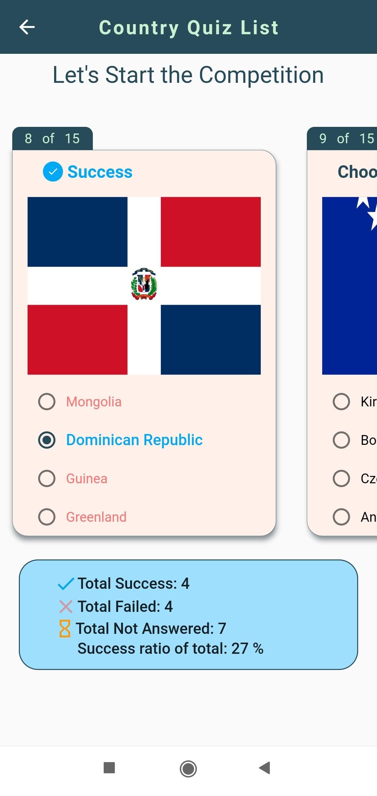

# flag_quiz

***********************************************************************************
****** new Flutter application for testing information about National Flag..*******
***********************************************************************************

## Screenshot:

